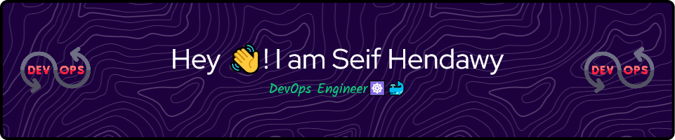

# Seif Hendawy

Hey there 👋

I'm a Fresh DevOps Engineer | AI Enthusiast

I'm a versatile IT professional with a strong foundation in DevOps, software engineering, and a passion for the limitless possibilities of AI and machine learning. Here's what sets me apart:

✅ DevOps Mastery: Proficient in essential DevOps tools, I streamline development and deployment, ensuring efficient software delivery.

✅ Full-Stack Flutter: My expertise extends to full-stack Flutter development, creating cross-platform, feature-rich applications.

✅ AI and Machine Learning: I've successfully implemented AI in real-world projects, such as the Computer Vision Based Smart Parking System, optimizing traffic flow and parking management using neural network models.

✅ Technical Acumen: Beyond AI, I have a strong background in Linux administration, databases, and various scripting languages.

✅ Project Success: I've contributed to impactful projects, such as Microsoft Dynamics 365 CRM development, information security, and educational grant consulting.

✅ Education: I hold a strong educational background, including internships and training in Full Stack Development using PHP & DevOps.

## 📌 Pinned Repositories

 

<!-- 
 

 

  -->

 
 

## &#x1f4c8; GitHub Stats

 

 
 

## 💼 Skills

Programing Skills

 

 

  
Other Skills 

   
  
  
  
  
  
  
  
  
  

